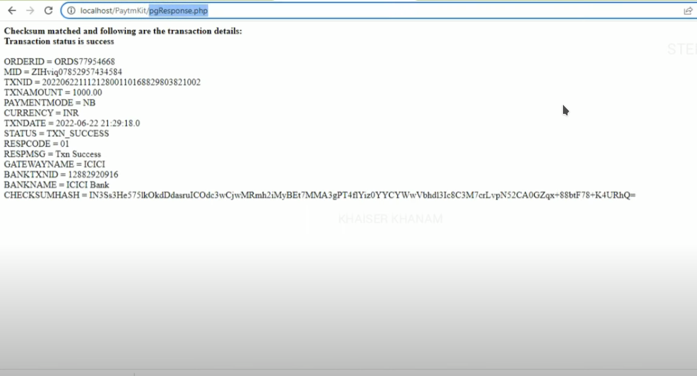

# Paytm Payment Gateway Integration in PHP

This repository contains the PHP code for integrating Paytm Payment Gateway into a web application. The integration allows for initiating transactions, checking their status, and handling the response from Paytm after the transaction is processed.

## Tech Stack

- **PHP**: Server-side scripting language used for backend logic.
- **HTML**: Used for structuring the web pages.
- **Paytm Payment Gateway API**: For handling payments.

## Pages and Functionality

### 1. `TxnTest.php`

This is the initial page where the user inputs transaction details such as order ID, customer ID, industry type, channel, and transaction amount.

- **Order ID**: Generated dynamically for each transaction.
- **Customer ID**: Predefined as 'CUST001'.
- **Industry Type ID**: Set as 'Retail'.
- **Channel**: Set as 'WEB'.
- **Transaction Amount**: User input.

### 2. `pgRedirect.php`

This page is responsible for sending transaction data to Paytm's server. It generates a checksum hash to ensure data integrity.

- **Checksum Generation**: For security, a checksum hash is generated and sent along with the transaction data.

### 3. `pgResponse.php`

This page handles the response from Paytm after the transaction processing.

- **Checksum Verification**: It verifies the checksum received from Paytm.
- **Transaction Status**: Displays whether the transaction was successful or failed.

### 4. `TxnStatus.php`

This page allows the user to query the status of a transaction by providing the order ID.

- **Order ID Input**: User can input the order ID to check the transaction status.
- **Transaction Status**: Shows the detailed status of the transaction.

## How to Use

1. Clone the repository to your local server environment.
2. Configure the `config_paytm.php` with your Paytm merchant details.
3. Access `TxnTest.php` to start a new transaction.
4. Use `TxnStatus.php` to check the status of a transaction.

## Security and Data Integrity

- **Checksum Hash**: Ensures that the data sent to and received from Paytm's server is not tampered with.
- **HTTPS Protocol**: It is recommended to use HTTPS to ensure secure data transmission.

## Requirements

- PHP 7 or higher.
- Paytm Merchant account for API keys and testing.

## Installation

1. Download or clone the repository.
2. Place it in your server's document root.
3. Configure the Paytm API keys in `config_paytm.php`.
4. Access the pages via a web browser.

---

For more details on Paytm's API and parameters, visit [Paytm Developer Documentation](https://developer.paytm.com/docs).

**Note**: This is a basic implementation and should be used as a starting point. Ensure to follow security best practices for production deployment.